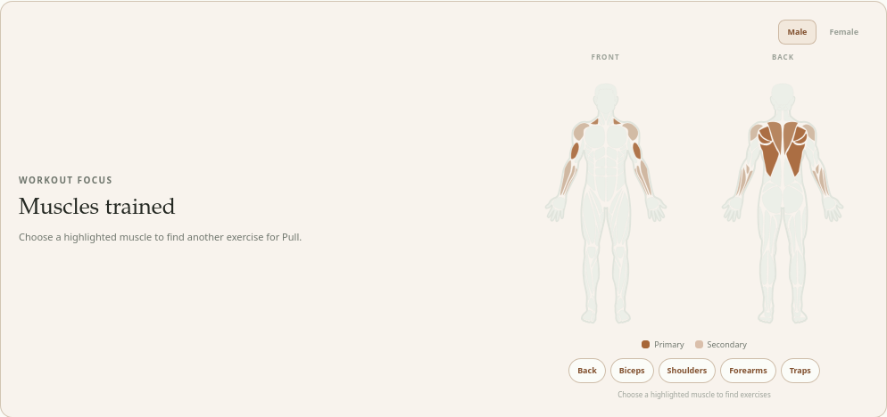
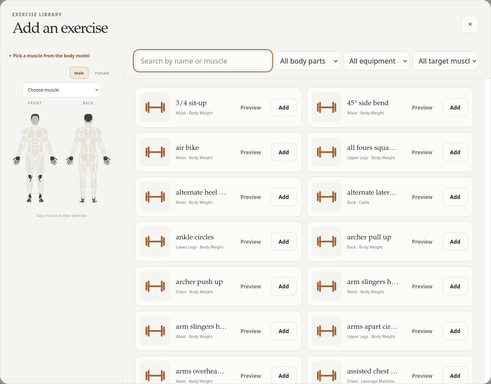
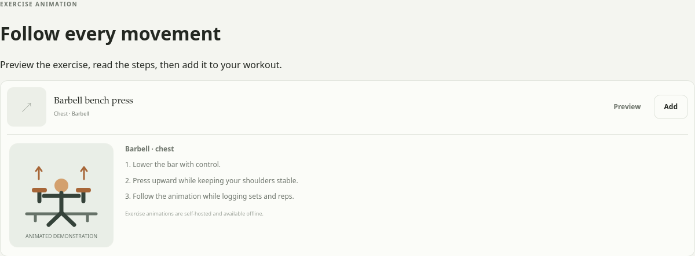

# Personal Gym

> This is one of the main projects I use on my home server. I decided to upload and share it because it has been genuinely useful for me in the gym: my weekly plan, exercise guidance, set logging, progress, and body weight all stay together in one quiet place without ads or a cloud account.

Personal Gym is a private, minimalist, self-hosted workout tracker designed to feel natural on both a phone at the gym and a desktop at home. It combines weekly planning, set-by-set logging, progression suggestions, body-weight history, exercise trends, interactive muscle maps, and animated exercise guidance.

## Highlights

- Build a weekly Push, Pull, Legs, or fully custom training plan.
- Log weight, reps, completed sets, and extra sets from the Today view.
- Track strength trends, workout consistency, personal records, and body weight.
- See primary and supporting muscles on detailed male or female front-and-back models.
- Select a muscle directly on the body to filter the exercise library.
- Preview locally hosted exercise animations and instructions before adding an exercise.
- Add custom exercises and import or export workout plans.
- Keep everything private and local in SQLite behind a Tailscale identity check.
- Use the responsive interface comfortably on desktop or phone, including while the mobile keyboard is open.

## Muscle-aware planning

Every workout automatically highlights its primary and supporting muscle groups. The model can switch between male and female anatomy, and selecting a highlighted area opens matching exercises.



The Add Exercise window turns the same anatomy model into a visual filter. You can select the body directly or use the accessible muscle dropdown, then search and filter the resulting exercise list.



## Exercise animations

Exercise previews combine a movement demonstration with short instructions, equipment details, and an Add action. Media is self-hosted, so animations remain available in the gym without depending on a third-party API at runtime.



The animation screenshot uses an original documentation illustration. Exercise-dataset media is not included in this repository; provide media you are licensed to use through the local catalog importer described below.

## Runtime

- Private URL: `/gym/`
- Loopback service: `127.0.0.1:18830`
- Configuration: `/home/ct/.config/personal-gym/config.json`
- SQLite data: `/home/ct/.local/share/personal-gym/gym.sqlite3`
- Licensed media: `/home/ct/.local/share/personal-gym/catalog-media/`

The app requires the configured `Tailscale-User-Login` header. It has no runtime dependency on GitHub or another exercise API.

## Exercise catalog

Eight starter exercises make a fresh install usable. To import the full metadata-only catalog, download a pinned `data/exercises.json` revision from `hasaneyldrm/exercises-dataset`, then run:

```sh
GYM_CONFIG=/home/ct/.config/personal-gym/config.json npm run catalog:import -- --source /path/to/exercises.json --revision <commit-sha>
```

The metadata and instructions are MIT-licensed. Images and GIFs are not. They are never downloaded automatically. After obtaining the necessary rights and supplying a local copy of the dataset, validate and import its 180×180 media with:

```sh
GYM_CONFIG=/home/ct/.config/personal-gym/config.json npm run catalog:media -- --source /path/to/licensed/exercises-dataset
```

The importer requires the upstream notice, rejects missing or non-180×180 files, copies only paths referenced by imported metadata, and preserves `NOTICE.md`.

## Development

```sh
npm install
npm run check
npm test
```

`npm run build:muscles` rebuilds the committed, self-hosted React muscle-map island. The rest of the browser application remains vanilla JavaScript and has no runtime CDN dependency. Third-party licensing is recorded in `THIRD_PARTY_NOTICES.md`.

The HTTP test binds a temporary loopback port. Production runs through the restrictive user systemd unit in `deploy/`.
